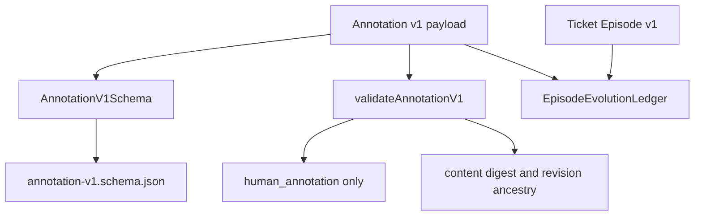

# Contracts

The contracts package contains bounded, versioned data contracts. TypeBox
values are the canonical structural source; the executable validators enforce
cross-field and provenance rules that JSON Schema cannot express.

Annotation v1 deliberately has `evidenceClass: human_annotation` as a
structural literal. An annotation can cite and describe an external event, but
no annotation contract path can create `observed_evidence`.
