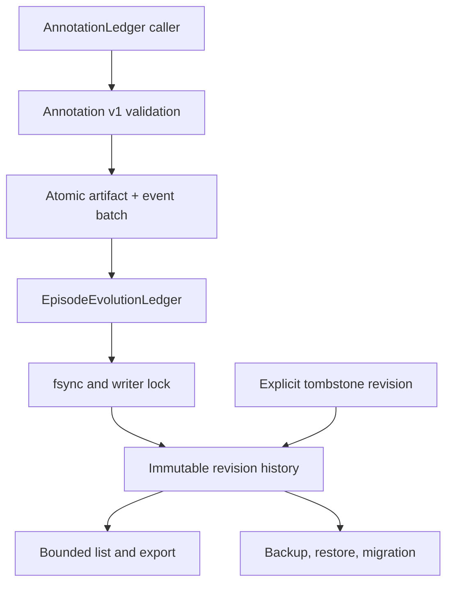

# Ledgers

Ledgers provide durable, bounded persistence facades over the append-only
Episode Evolution ledger.

`AnnotationLedger` owns annotation identity, revision ancestry, tombstone and
query semantics. `EpisodeEvolutionLedger` owns durable publication, recovery,
content-addressed bytes, physical backup/restore, and ledger-format migration.
